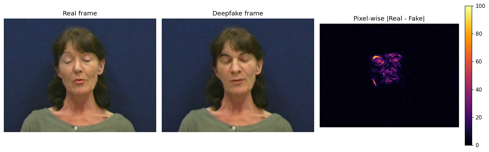
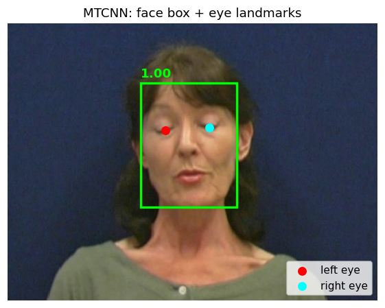
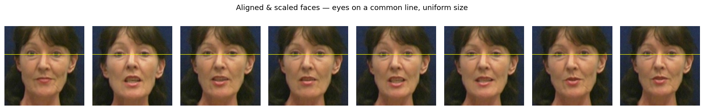
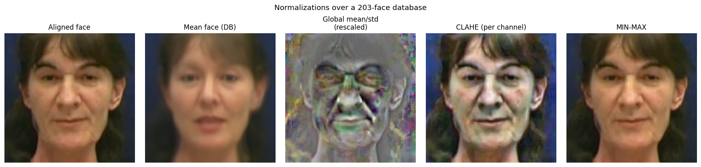
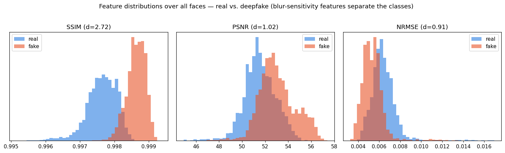
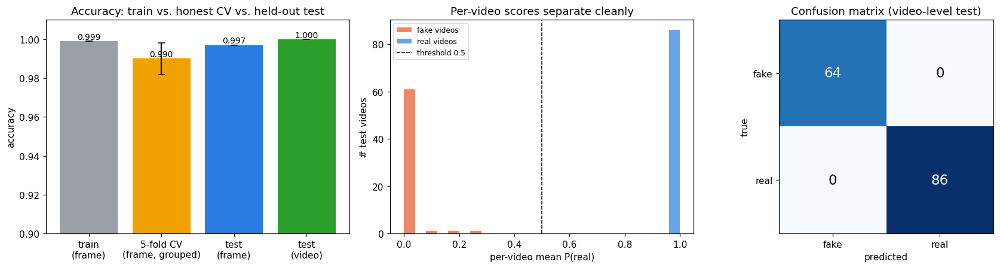
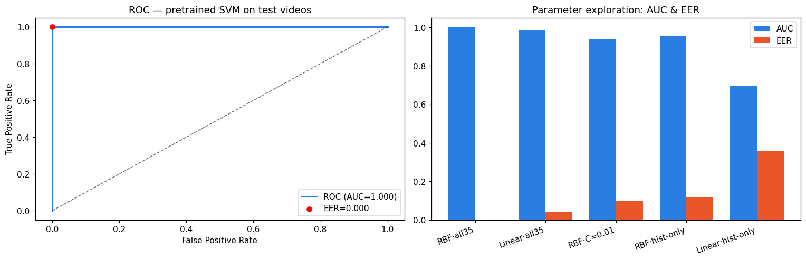

# Deepfake Video Detection

## Why deepfake detection matters

**Deepfakes** are videos in which the face of a person is automatically swapped with the face of
another person, typically using a pretrained **generative adversarial network (GAN)**. As these
models improve, deepfake videos look more and more realistic, and it is becoming increasingly
difficult to tell a genuine video from a manipulated one. The same technology that powers harmless
entertainment can be used for fraud, disinformation, and identity abuse — so a growing body of work
is dedicated to **automatically detecting deepfakes**.

A critical component of any such system is **feature extraction**. A *feature* is a value or set of
values that characterizes and distinctly describes the sample we want to classify — here, a video or
a single video frame. For a given problem it is rarely obvious which features best describe the
signal, but there are principled approaches for finding good descriptors and computing them reliably
for the faces detected in a video. This project builds that feature-extraction foundation step by
step.

As a first hint that the problem is tractable: subtracting a real frame from its corresponding
deepfake frame shows that the manipulation is **spatially localized to the face**, while the
background is untouched — exactly the kind of structured signal a detector can learn.



## The data

We use two paired datasets:

| Dataset | Role | Layout |
|---|---|---|
| **VidTIMIT** | Original / **real** videos | `Data/VidTIMIT/<subject>/<utterance>.avi` |
| **DeepfakeTIMIT** | GAN face-swapped / **fake** videos | `Data/DeepfakeTIMIT/higher_quality/<subject>/<utterance>-video-<source>.avi` |

Real and fake clips correspond by subject and utterance (e.g. real `fadg0/sa1.avi` ↔ fake
`fadg0/sa1-video-fram1.avi`). Each clip is a short talking-head recording at **512×384**, roughly 119
frames. Because each fake is a face swap of a specific real recording, the datasets are naturally
paired for analysis. *(The raw video data is not committed to this repository.)*

## Pipeline so far

The goal of these early milestones is to turn raw videos into a **clean, uniform set of face images**
ready for feature extraction. Each step is a self-contained Jupyter notebook under `Scripts/`.

### 1. Frames → images (`video_frame_to_image.ipynb`)
Recursively enumerate videos with `glob`, decode frames with OpenCV, and inspect their representation
(each frame is an `(H, W, 3)` `uint8` NumPy array, BGR channel order). We save and compare a matching
real/fake frame pair and compute their pixel-wise difference (figure above), confirming edits are
concentrated on the face.

### 2. Face & landmark detection (`face_detection.ipynb`)
Detect faces and facial landmarks in every frame using **MTCNN** (via `facenet-pytorch`). For each
face we extract the bounding box `(x, y, w, h)` and the **left/right eye** coordinates — the inputs
needed to align faces consistently. Detected faces are cropped and cached to disk so detection isn't
repeated.



### 3. Alignment & scaling (`face_alignment.ipynb`)
`crop_and_align()` uses the eye locations to **rotate** each face so the eyes are horizontal,
**scale** it so the inter-eye distance is fixed, and **warp** it into a fixed-size canvas
(`256×256`, left eye at 35%). The result: every face is centered the same way and the same size —
essential for downstream comparison.



### 4. Normalization (`face_normalization.ipynb`)
Three normalizations are applied to the aligned faces, targeting the **best representation for a
learning algorithm, not the human eye** (so some outputs no longer look like faces):

- **Global mean/std** — subtract the database mean face and divide by its per-pixel standard
  deviation (output has mean ≈ 0, std = 1).
- **Histogram equalization (CLAHE)** — adaptive, per colour channel, boosting local contrast.
- **Contrast/brightness (MIN-MAX)** — linearly stretch each face to the full 0–255 range.



## Machine learning method for deepfake detection

With a clean, uniform set of faces in hand, the detection problem becomes a **feature-extraction and
classification** problem: turn each face into a compact numerical vector, store those vectors, and
train a classifier to separate genuine faces from deepfakes.

### 5. Feature computation & storage (`machine-learning-for-deep-fake/LP3_compute_features.ipynb`)

For **every** video in the dataset we sample a fixed number of frames (a parameter, here 10), detect
and align the face, and compute a **35-dimensional feature vector** per face:

- **SSIM, normalized-RMSE and PSNR** between the face and a slightly **blurred** copy of itself. These
  measure how much high-frequency detail the face contains — the key intuition being that GAN-generated
  faces tend to be *smoother*, so they change less when blurred.
- A **32-bin intensity histogram** of the face.

The features for each video are stored as a matrix of shape *(frames × features)* in **one HDF5 file
per video**. Genuine and deepfake features are written to **separate, mirrored folders** so every
feature file's origin is unambiguous:

```
Data/Features/
├── real/<subject>/<utterance>.h5      # 430 files
└── fake/<subject>/<utterance>.h5      # 320 files
```

**Which features are good descriptors?** Plotting the feature distributions across all ~7,500 extracted
faces answers this directly. The blur-sensitivity features are strongly discriminative — **SSIM
separates the classes with Cohen's *d* ≈ 2.7** — confirming that deepfake faces are measurably smoother
than real ones (higher SSIM/PSNR, lower RMSE against their blurred copy).



### 6. Train/test split & SVM training (`machine-learning-for-deep-fake/LP4_train_svm.ipynb`)

Videos are split **80/20 at the video level** (not the frame level) and **stratified** by class, so all
of a video's frames stay on one side of the split and both classes keep their proportions (600 train /
150 test). Training features are gathered from the training videos only into one `X_train` array
(frame vectors) with integer labels `y_train` (**1 = real, 0 = deepfake**), and a **scaled RBF SVM**
(`StandardScaler` + `SVC`) is trained on them.

### Training results & analysis

A frame-level **training accuracy of 0.999** by itself proves little — a flexible model can memorize its
training data. To understand whether the classifier actually *generalizes*, we look at three things:



- **Honest cross-validation (grouped by video).** A 5-fold CV that keeps each video's frames within a
  single fold — so no video is ever in both train and validation — gives **0.990 ± 0.008 accuracy**
  (AUC ≈ 1.0). The fact that this near-matches the training accuracy tells us the model is **not
  overfitting**.
- **Held-out test set.** Frame-level test accuracy is **0.997**. Aggregating a video's frame
  probabilities into a single per-video score (the correct evaluation unit) yields **100% accuracy and
  AUC = 1.0** on the 150 test videos — the middle panel shows fake and real videos collapsing to
  opposite ends of the score axis with a wide margin around the 0.5 threshold.
- **Why per-video beats per-frame.** Averaging ~10 frame scores per video cancels the occasional noisy
  frame, which is exactly why the pipeline was designed to score whole videos rather than individual
  frames.

**Why is it this strong, and what's the catch?** The blur-sensitivity features (SSIM, PSNR, RMSE) are
extremely discriminative here because DeepfakeTIMIT's GAN faces are *systematically smoother* than the
real VidTIMIT faces — a single, consistent artifact. Two honest caveats temper the near-perfect score:
the split is video-independent but **not subject-independent** (the same people appear in train and
test, so identity cues may leak), and results come from **one dataset** of a specific GAN. Against
unseen identities and more advanced deepfakes the numbers would drop — a subject-disjoint and
cross-dataset evaluation is the natural next test.

## Evaluation

The final milestone (`machine-learning-for-deep-fake/LP5_evaluate_svm.ipynb`) takes the **pretrained
SVM** and scores the **held-out test videos** only — the model already saw the training videos, so
scoring them would be meaninglessly optimistic. The test-set features (150 videos) are kept in separate
`Data/Features_test/real/` and `Data/Features_test/fake/` folders so each prediction's ground truth is
unambiguous.

**From frame labels to a video decision.** The SVM outputs a 0/1 label for each frame's feature vector.
Each video's frames are collapsed into a single **per-video score = the mean of its frame labels**; a
score **above 0.5** is called genuine, **below 0.5** a deepfake. Averaging ~10 frames per video cancels
the occasional misclassified frame.

**Results on the 150 test videos (86 genuine, 64 deepfake):**

| Metric | Value | Meaning |
|---|---|---|
| Accuracy | **100%** | videos labeled correctly |
| **FPR** (false-positive rate) | **0.00** | deepfakes wrongly accepted as genuine ÷ all deepfakes |
| **FNR** (false-negative rate) | **0.00** | genuine wrongly rejected as deepfake ÷ all genuine |
| **AUC** | **1.00** | area under the ROC curve (threshold-independent separability) |
| **EER** | **0.00** | equal error rate — the operating point where FPR = FNR |



The ROC curve (left) hugs the top-left corner and the EER point sits at the origin: genuine and deepfake
videos are perfectly separated at every threshold.

**Which parameters actually drive the result?** Sweeping the classifier and the feature set (right
panel) shows the performance is **carried by the blur-sensitivity features** (SSIM, PSNR, RMSE), not the
histogram:

| Configuration | AUC | EER |
|---|---|---|
| RBF SVM · all 35 features | **1.000** | **0.000** |
| Linear SVM · all 35 features | 0.984 | 0.039 |
| RBF SVM · weak regularization (C=0.01) | 0.938 | 0.099 |
| RBF SVM · histogram-only (32 features) | 0.952 | 0.119 |
| Linear SVM · histogram-only | 0.693 | 0.358 |

Dropping the three blur metrics collapses a linear SVM from AUC ≈ 0.98 to ≈ 0.69, confirming they are
the signal. The RBF kernel and proper regularization matter too. Other knobs the pipeline exposes — the
**cropped-face size** and the **Gaussian-blur kernel/sigma** used to build the blurred reference — change
the feature values themselves and are the natural next parameters to sweep.

> **Reading the perfect score honestly.** 100% / EER 0 is a property of *this* benchmark, not proof of a
> universal detector: the split is video- but **not subject-independent**, and every clip comes from one
> dataset and one GAN whose faces share a consistent smoothing artifact. On unseen identities and
> stronger generators the EER would rise — which is exactly why the roadmap's next step is a
> subject-disjoint, cross-dataset evaluation.

## Technologies

- **Python 3.10** (conda env `deepfake-detect`)
- **OpenCV** — video decoding, geometric warping (`getRotationMatrix2D`, `warpAffine`), CLAHE, MIN-MAX
- **facenet-pytorch (MTCNN)** on **PyTorch** — face + facial-landmark detection
- **scikit-image** — image-similarity metrics (SSIM, PSNR, normalized-RMSE) for feature computation
- **scikit-learn** — train/test split, SVM classifier, grouped cross-validation, evaluation metrics
- **h5py (HDF5)** — on-disk storage of per-video feature matrices
- **NumPy** — array representation and global statistics
- **Matplotlib** — visualization
- **Jupyter** — one notebook per milestone

## Repository structure

```
Deepfake-Detection/
├── Scripts/
│   ├── video_frame_to_image.ipynb              # Step 1: frames → images, real/fake diff
│   ├── face_detection.ipynb                    # Step 2: MTCNN detection + landmarks
│   ├── face_alignment.ipynb                    # Step 3: crop_and_align()
│   ├── face_normalization.ipynb                # Step 4: three normalizations
│   ├── visual_extraction/                      # real vs. fake face comparison (diff, hist, SSIM, ORB)
│   └── machine-learning-for-deep-fake/
│       ├── LP3_compute_features.ipynb          # Step 5: features → HDF5 (real/fake)
│       ├── LP4_train_svm.ipynb                 # Step 6: split + SVM training & results
│       └── LP5_evaluate_svm.ipynb              # Step 7: test-set evaluation (EER, ROC, sweep)
├── assets/                          # figures used in this README
├── Data/                            # raw videos, generated crops, Features/ (not tracked)
└── README.md
```

## Running the notebooks

```bash
conda activate deepfake-detect
jupyter notebook   # then open a notebook in Scripts/ and select the deepfake-detect kernel
```

> On macOS, PyTorch and OpenCV each bundle an OpenMP runtime; the notebooks set
> `KMP_DUPLICATE_LIB_OK=TRUE` in their first cell to avoid a crash when both are imported.

## Status & roadmap

- [x] **Data preparation** — frame extraction, MTCNN face & landmark detection, eye-based alignment,
  and normalization.
- [x] **Feature extraction** — per-video 35-D feature vectors stored as HDF5, split by class.
- [x] **Classifier training** — video-level stratified split and a scaled RBF SVM; validated with
  grouped cross-validation (0.990 ± 0.008) and a held-out test set (100% video-level accuracy, AUC 1.0).
- [x] **Evaluation** — pretrained SVM scored on the held-out test videos: accuracy 100%, FPR/FNR 0,
  AUC 1.0, EER 0.0, plus a classifier/feature parameter sweep (see [Evaluation](#evaluation)).
- [ ] **Harder evaluation** — subject-disjoint and cross-dataset tests to measure real-world robustness.
- [ ] **Wrap-up** — error analysis, threshold/latency trade-offs, and final write-up.

This README will continue to be enriched as these remaining steps are completed and the project is
wrapped up.
